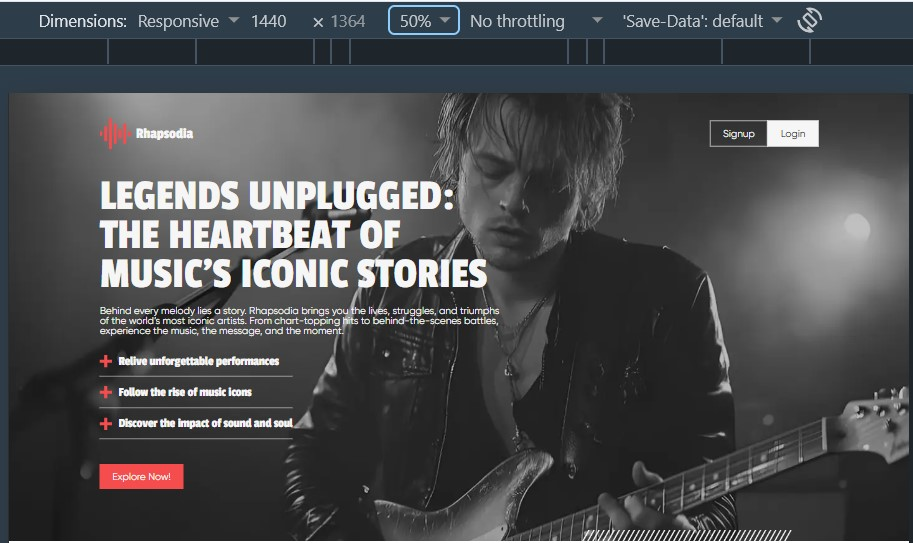
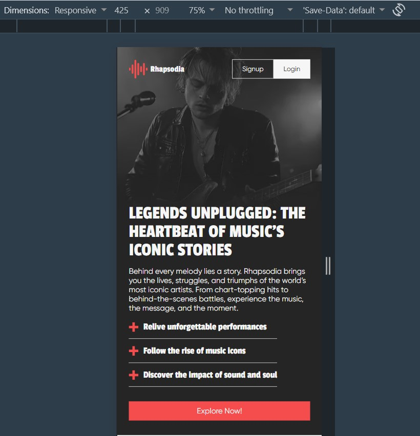

# Rhapsodia — Landing Page Demo

A responsive landing page for a fictional music storytelling platform about the lives and iconic stories of legendary artists. Created as a front-end portfolio project from a Figma mockup.

**Demo:** https://zhuridochka.github.io/rhapsodia_demo/

## Screenshots

| Desktop | Mobile |
|---|---|

|  | 

## Highlights
- Hero section with a full-width background photo, adapted for desktop and mobile
- Bold display typography with a dark palette and red accent color
- Header with Signup / Login buttons
- Feature list with custom markers and a call-to-action button
- Responsive layout, tested at 1440 px and 425 px

## Tech stack
HTML5, CSS3, JavaScript

## Run locally
Clone the repository and open `index.html` in your browser.
